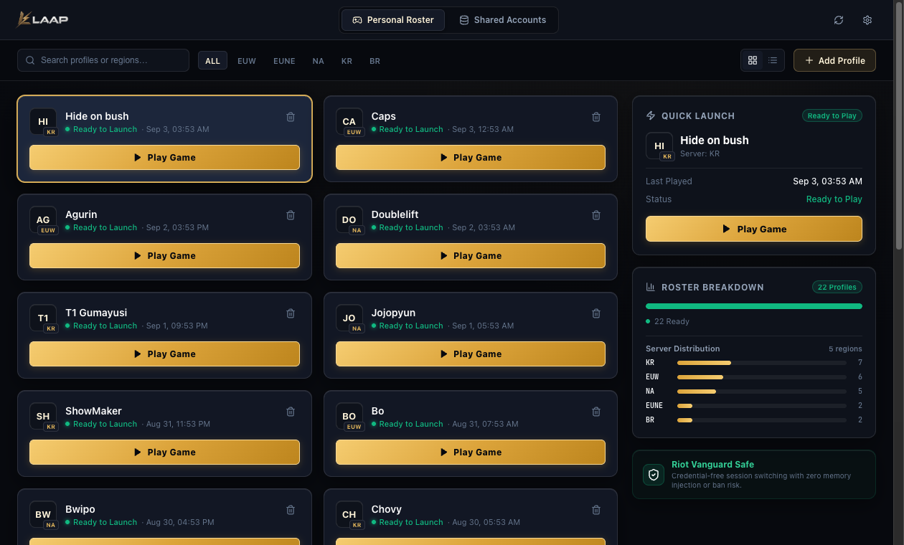
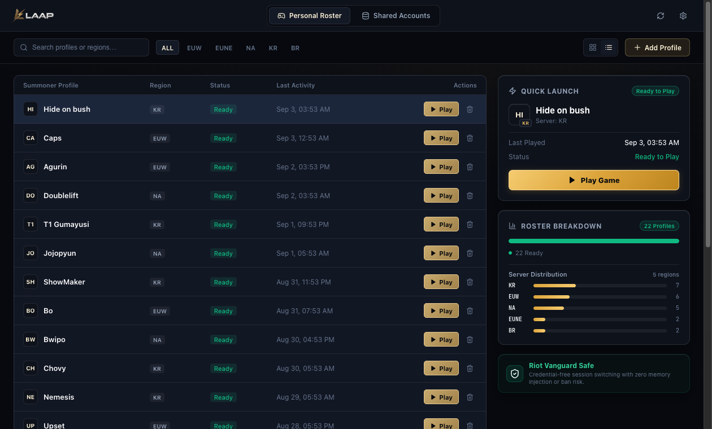
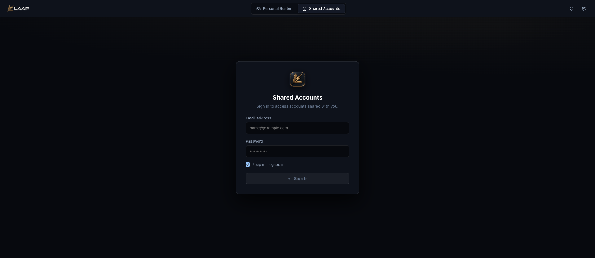

<div align="center">


<br />

**High-performance tactical account control plane and desktop launcher for League of Legends.**

[](https://github.com/Kingof3O/laap/releases/latest)
[](https://github.com/Kingof3O/laap/actions)
[](docs/ARCHITECTURE.md)
[](https://tauri.app/)
[](https://www.rust-lang.org/)
[](https://www.typescriptlang.org/)
[](docs/ANTI_BAN_VERIFICATION.md)
[](LICENSE)

[**Download for macOS (.dmg)**](https://github.com/Kingof3O/laap/releases/latest) • [**Download for Windows (.exe / .msi)**](https://github.com/Kingof3O/laap/releases/latest)

[Architecture](docs/ARCHITECTURE.md) • [Anti-Ban Proofs](docs/ANTI_BAN_VERIFICATION.md) • [Security Model](docs/SECURITY_MODEL.md) • [API Reference](docs/API.md) • [Developer Guide](docs/DEVELOPMENT.md) • [Production Guide](docs/PRODUCTION.md)

</div>

---

## 🌟 Overview

**LAAP** (League Account Access Platform) is an esports-grade, credential-free tactical desktop launcher and account management control plane. Engineered specifically for competitive players, organizations, and scrim rosters, LAAP eliminates the friction of multi-account management without storing plaintext passwords or triggering Riot Vanguard anti-cheat heuristics.

The platform couples a native **Hextech Tactical Desktop Launcher** (built with Tauri v2, Rust, and React 19) with a centralized **Web Control Center** (Cloudflare Pages + Workers + Supabase).

---

## 🖥️ Full Cross-Platform Parity (Windows & macOS)

LAAP provides 100% feature parity and native OS integration on both **Windows** and **macOS**:

| Component / Subsystem | Windows (10 & 11 64-bit) | macOS (Apple Silicon & Intel) |
|:---|:---|:---|
| **Hardware Key Storage** | Windows Credential Manager (`windows-native`) | Apple Keychain (`apple-native`) |
| **Riot Data Directory** | `%LOCALAPPDATA%\Riot Games\Riot Client\Data` | `~/Library/Application Support/Riot Games/Riot Client/Data` |
| **Local Store Directory** | `%APPDATA%\LAAP\` | `~/Library/Application Support/LAAP/` |
| **Process Execution** | Spawns `RiotClientServices.exe` directly | Dispatches via `/Applications/Riot Client.app` |
| **Process Inspection** | Native Windows sysinfo PID & handle polling | Darwin sysinfo PID & process inspection |
| **Tactical Hotkeys** | `Ctrl+K` (Search), `Esc`, `Tab`, `Enter` | `⌘K` (Search), `Esc`, `Tab`, `Enter` |
| **Distribution Packages** | Windows Installer (`.msi`) & NSIS (`.exe`) | Apple Disk Image (`.dmg`) & App Bundle (`.app`) |

---

## 📸 Interface Preview

### 🎮 Personal Roster & Quick Launch
Manage your entire summoner portfolio with 1-click credential-free launching, live session health, and real-time server distribution analytics.

<div align="center">
  
</div>

<br />

### 📋 High-Density Compact Table View
Quickly filter, sort, and launch across dozens of accounts with instant search (`⌘K` / `Ctrl+K`) and regional filters (`EUW`, `NA`, `KR`, `EUNE`, `BR`).

<div align="center">
  
</div>

<br />

### 🌐 Shared Accounts Access
Access shared accounts with atomic single-active session locking, hardware signature verification, and instant release mechanics.

<div align="center">
  
</div>

---

## ⚔️ Why LAAP? (Comparison Matrix)

| Feature / Guarantee | Traditional Account Launchers | Browser Password Managers | LAAP Tactical Platform |
|:---|:---:|:---:|:---:|
| **Password Storage** | Plaintext / Weak AES on disk | Encrypted vault (requires master pass) | **Zero Passwords Handled** (Session-based) |
| **Vanguard Anti-Cheat Safety** | ⚠️ High ban risk (keystrokes / memory) | N/A | **100% Safe** (External config sandboxing) |
| **1-Click Game Launch** | ❌ (Prompts for 2FA / CAPTCHA) | ❌ (Manual copy-paste) | **Instant** (Direct authenticated boot) |
| **Multi-Server Organization** | ❌ Flat list | ❌ Flat list | **Built-in Filters** (`EUW`, `NA`, `KR`, `BR`) |
| **Hardware Binding** | ❌ None | ❌ None | **Ed25519 OS Keychain Keypair** |
| **Shared Account Protection** | ⚠️ Concurrent collision conflicts | ⚠️ Password leaks & desyncs | **Atomic Single-Active Lease Locking** |
| **In-App Release Updates** | ❌ Manual browser checks | N/A | **Automatic GitHub Releases Popup** |

---

## 🛡️ Anti-Cheat & Vanguard Safety Proofs

LAAP is built from the ground up to operate strictly as an **external pre-launch configuration manager**. It guarantees a **0% ban risk**:

- **Zero Memory Injection:** Never calls `WriteProcessMemory`, `VirtualAllocEx`, or attaches debuggers to League or Riot processes.
- **Zero Code Hooks:** Does not inject DLLs, hook DirectX/Direct3D graphics pipelines, or alter operating system APIs.
- **Zero Game Asset Modifications:** Game binaries and archives (`.wad`, `.exe`, `.dll`) remain bit-for-bit identical.
- **Standard Process Execution:** Boots the official Riot Client using standard, verified launch flags (`--launch-product=league_of_legends --launch-patchline=live`).
- **Full Riot TOS Compliance:** Does not provide in-game automation, macros, overlay advantages, or cooldown timers.

👉 **Read the complete source code proofs and verification guide in [docs/ANTI_BAN_VERIFICATION.md](docs/ANTI_BAN_VERIFICATION.md).**

---

## 🛡️ Core Pillars & Architecture

### 1. Passwordless Session Sandboxing
LAAP **strictly never prompts for, collects, stores, or handles Riot account passwords**.
- Operates directly at the authenticated session token layer.
- Authenticate once via the official Riot Client with *"Stay signed in"* enabled.
- LAAP captures the ephemeral session token, secures it in the local OS keychain, and injects it upon launch.
- When switching accounts, personal client settings and configurations are safely preserved and restored.

### 2. Ed25519 Hardware Device Authentication
- Every physical installation generates a unique **Ed25519 cryptographic keypair** stored in the native OS keychain (macOS Keychain / Windows Credential Manager).
- Shared account sessions require signing a time-bound cryptographic challenge (`${timestamp}:${accountId}`).
- Replay attacks, spoofed requests, and unauthorized machines are rejected at the edge.

### 3. Dual Operation Modes
- **🎮 Personal Roster (Local Mode):** Completely standalone 1-click account switching on your local machine. Zero cloud dependency, zero network requirements, zero passwords.
- **🌐 Shared Accounts (Cloud Mode):** Shared account pool with atomic single-active lease enforcement, role-based access control, and real-time activity auditing.

### 4. Real-Time Roster Analytics & Health
- **Segmented Readiness Bar:** Real-time visual tracking of ready, in-use, and unsynced accounts.
- **Server Distribution:** Proportional breakdown across competitive server regions (`EUW`, `NA`, `KR`, `BR`, `EUNE`).
- **Quick Launch Dossier:** Instant inspection of selected profiles, last-played timestamps, and one-click game launch.

### 5. In-App Release Notifications
- **Automatic Version Polling:** Seamlessly compares installed version against the public GitHub Releases API on launch.
- **Hextech Release Modal:** Displays new version highlights, changelog summaries, and a direct 1-click browser download CTA.
- **Manual Verification:** Players can verify release status anytime via the **`Check for Updates`** action in Launcher Settings.

---

## ⌨️ Tactical Controls & Hotkeys

| Shortcut | Action | Scope |
|:---|:---|:---|
| `⌘K` / `Ctrl+K` | Focus instant summoner search | Global (macOS / Windows) |
| `Esc` | Clear search query / Dismiss open modal | Global |
| `Tab` | Cycle through account cards and launch actions | Roster View |
| `Enter` | Launch selected summoner profile | Quick Launch |

---

## 🏛️ System Architecture

```text
┌────────────────────────────────────────┐       ┌──────────────────────────────────────┐
│       LAAP Desktop Launcher            │       │       Web Control Center             │
│   (Tauri v2 + Rust + React 19)         │       │     (React 19 + Tailwind CSS)        │
└──────────────────┬─────────────────────┘       └──────────────────┬───────────────────┘
                   │                                                │
                   │ typed DTOs & Zod contracts                     │ typed DTOs
                   ▼                                                ▼
┌───────────────────────────────────────────────────────────────────────────────────────┐
│                    Shared Packages (@laap/types, @laap/validation)                     │
└──────────────────────────────────────────┬────────────────────────────────────────────┘
                                           │ authenticated HTTP / Bearer / Cookies
                                           ▼
┌───────────────────────────────────────────────────────────────────────────────────────┐
│              LAAP Core API (Node HTTP / Cloudflare Worker: laap-api)                  │
│               - Domain Interfaces: IAuth, IAccount, ILease, IDevice, IAdmin           │
│               - Modular Domain Services (SQLite & Supabase PostgreSQL)                │
└──────────────────────────────────────────┬────────────────────────────────────────────┘
                                           │
                                           ▼
┌───────────────────────────────────────────────────────────────────────────────────────┐
│            Supabase Cloud Infrastructure (PostgreSQL, Vault, Auth, RLS)               │
│               - Atomic lease acquisition functions (Postgres RPC)                     │
│               - Row Level Security (RLS) enforcement on all tables                    │
│               - Encrypted session blob storage & access policies                      │
└───────────────────────────────────────────────────────────────────────────────────────┘
```

Detailed architectural diagrams and domain breakdowns are available in [docs/ARCHITECTURE.md](docs/ARCHITECTURE.md).

---

## 🚀 Development & Build Guide

### Prerequisites
- **Node.js**: v20 or v22 LTS
- **Rust**: 1.80+ (`rustc` & `cargo`)
- **macOS Requirements**: Xcode Command Line Tools (`xcode-select --install`)
- **Windows Requirements**: Visual Studio Build Tools (C++ Desktop Development) and WebView2 Runtime

### Local Setup
```bash
# 1. Clone repository
git clone https://github.com/Kingof3O/laap.git
cd laap

# 2. Install dependencies
npm install

# 3. Start local development
npm run dev
```

### Building Native Desktop Releases

#### On macOS
```bash
# Build native macOS universal App bundle & DMG installer
npm --workspace @laap/desktop run build
npx --workspace @laap/desktop tauri build --bundles app,dmg
```

#### On Windows (PowerShell)
```powershell
# Build native Windows installer (.msi & .exe)
npm --workspace @laap/desktop run build
npx --workspace @laap/desktop tauri build --bundles msi,nsis
```

### Verification & Testing
```bash
# Run unit and integration tests across monorepo
npm run test

# Run native Rust desktop core tests
cargo test --manifest-path apps/desktop/src-tauri/Cargo.toml
```

---

## 📜 License

Distributed under the MIT License. See [LICENSE](LICENSE) for details.
