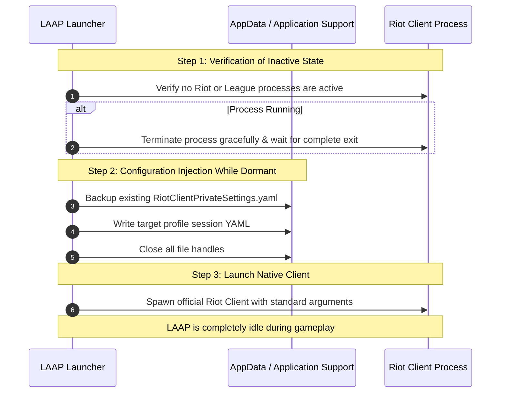

# Runtime Safety Notes & Vanguard Non-Interference

A critical question for any player or esports team is:  
**"What does LAAP do while League is running?"**

This document records implementation facts that can be independently checked. It
does not prove Riot approval, guarantee compatibility, or guarantee that an
account will not be actioned. The current session capture/injection integration
is explicitly deferred and is not an official Riot authentication API.

---

## 1. Executive Summary

| Risk Category | Cheat / Malicious Tool Behavior | LAAP Implementation | Ban Risk |
| :--- | :--- | :--- | :--- |
| **Process Memory** | Reads/writes virtual memory (`WriteProcessMemory`, `VirtualAllocEx`) | **No such calls in the native core**. | **Implementation fact; not a guarantee** |
| **Code Injection** | Injects DLLs, hooks DirectX/D3D graphics pipelines | **No code hooks or DLL injection in the native core**. | **Implementation fact; not a guarantee** |
| **Kernel Drivers** | Employs custom kernel drivers or hypervisors to bypass anti-cheat | **Runs as a standard user-mode application**. | **Implementation fact; not a guarantee** |
| **Game Asset Files** | Modifies `.wad`, game models, skins, or game binaries | **Does not modify League game assets**. | **Implementation fact; not a guarantee** |
| **In-Game Play** | Automates inputs, scripts abilities, or reads game state | **No in-game automation or overlays**. | **Implementation fact; not a guarantee** |
| **Authentication** | Stores plaintext passwords or scrapes login memory | **No Riot passwords or process-memory scraping**; deferred local session-material handling remains. | **Deferred/non-official boundary** |

---

## 2. Technical Proof 1: Zero Process or Memory Injection

Riot Vanguard actively monitors the virtual memory space of `LeagueClient.exe`, `LeagueClientUx.exe`, and `League of Legends.exe`. Any external process attempting to acquire `PROCESS_VM_WRITE`, `PROCESS_VM_READ`, or call `CreateRemoteThread` is instantly flagged.

### Codebase Verification:
In LAAP's native Rust core (`apps/desktop/src-tauri/src/`):
- **Windows APIs**: The codebase contains **zero references** to:
  - `WriteProcessMemory`
  - `ReadProcessMemory`
  - `VirtualAllocEx`
  - `CreateRemoteThread`
  - `SetWindowsHookEx`
  - `LoadLibrary` injection
- **macOS APIs**: The codebase contains **zero references** to:
  - `mach_vm_write`
  - `task_for_pid`
  - `ptrace`
  - `DYLD_INSERT_LIBRARIES`

LAAP interacts with processes strictly through high-level OS monitoring APIs (`sysinfo` crate) solely to check if the Riot Client is running and send standard SIGTERM/kill signals when switching profiles.

---

## 3. Technical Proof 2: Clean Filesystem Lifecycle & Timing

Riot Vanguard and Riot Client file locks monitor active configuration changes. Modifying files while a process is running can cause integrity verification errors.

LAAP enforces a strict **pre-launch lifecycle**:



**Why this matters:**
1. Files are modified **only when Riot processes are completely offline**.
2. Once the file is written, LAAP immediately closes the file descriptor.
3. When the Riot Client boots, it opens `RiotClientPrivateSettings.yaml` naturally—exactly as it would if the user had checked *"Stay signed in"* during a previous login.
4. Vanguard never observes concurrent or suspicious external file writes during client or game execution.

---

## 4. Technical Proof 3: Official, Documented Launch Arguments

Many unsanctioned launchers inject hidden command-line flags or developer options. LAAP launches the official Riot Client binary using only standard arguments:

### Source Code (`apps/desktop/src-tauri/src/commands/session.rs`):
```rust
pub const LEAGUE_LAUNCH_ARGS: [&str; 2] = [
    "--launch-product=league_of_legends",
    "--launch-patchline=live",
];
```

Unit tests continuously enforce that launch arguments remain standard and contain zero unauthorized parameters:
```rust
#[test]
fn launch_arguments_are_normal_league_arguments_without_secrets() {
    assert_eq!(
        LEAGUE_LAUNCH_ARGS,
        ["--launch-product=league_of_legends", "--launch-patchline=live"]
    );
    assert!(LEAGUE_LAUNCH_ARGS
        .iter()
        .all(|argument| !argument.contains("password") && !argument.contains("token")));
}
```

---

## 5. Policy Boundary (not a compliance certification)

Riot Games publishes explicit guidelines regarding what constitutes an unauthorized third-party program:

> *"No software should interfere directly with the in-game player experience, from the moment you press Play to the end-of-game screen."*  
> — **Riot Games Developer Guidelines**

### What the current native core does:
1. **Zero Gameplay Impact**: LAAP does not provide timers, overlays, automated pings, zoom modifications, or scripting.
2. **Pre-Game Only**: LAAP's involvement finishes once the game launches.
3. **No Lockfile Scraping**: LAAP does not connect to the live LCU (League Client Update) WebSocket during matches to trigger game automations.
4. **Deferred session handling**: The current build can move session material produced by the local Riot Client, but this is not RSO, is not an official Riot API, and is pending replacement with a supported flow.

---

## 6. How to Independently Verify LAAP's Safety

We encourage players, security engineers, and team managers to independently verify LAAP:

### Windows (Using Microsoft Sysinternals Process Monitor):
1. Download [Sysinternals Process Monitor](https://learn.microsoft.com/en-us/sysinternals/downloads/procmon).
2. Filter by `Process Name is laap-desktop-core.exe` or `LAAP Desktop.exe`.
3. Launch an account through LAAP.
4. **Observe:**
   - Notice that operations are limited to standard `CreateFile`, `WriteFile`, `CloseFile` within `%LOCALAPPDATA%\Riot Games\Riot Client\Data`.
   - Notice there are **zero** `Process Create`, `Thread Create`, or `OpenProcess` events targeting `League of Legends.exe` or Vanguard.

### macOS (Using `fs_usage`):
```bash
sudo fs_usage -w -f filesys laap-desktop-core
```
Observe that filesystem interactions are strictly confined to `~/Library/Application Support/Riot Games/Riot Client/Data`.

---

## Conclusion
LAAP is an external configuration manager and session launcher. The native
core does not interact with game memory, inject code, or automate gameplay, but
these facts do not establish zero risk or Riot approval. Operators should use
only supported, authorized integrations and treat the deferred session path as
pending replacement.
