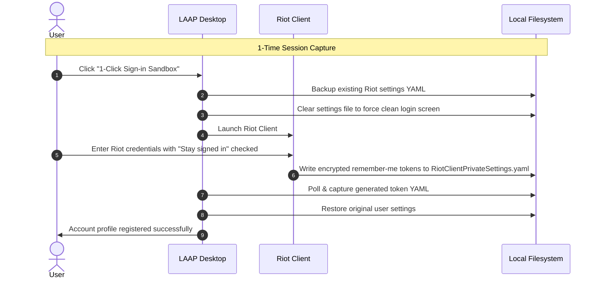
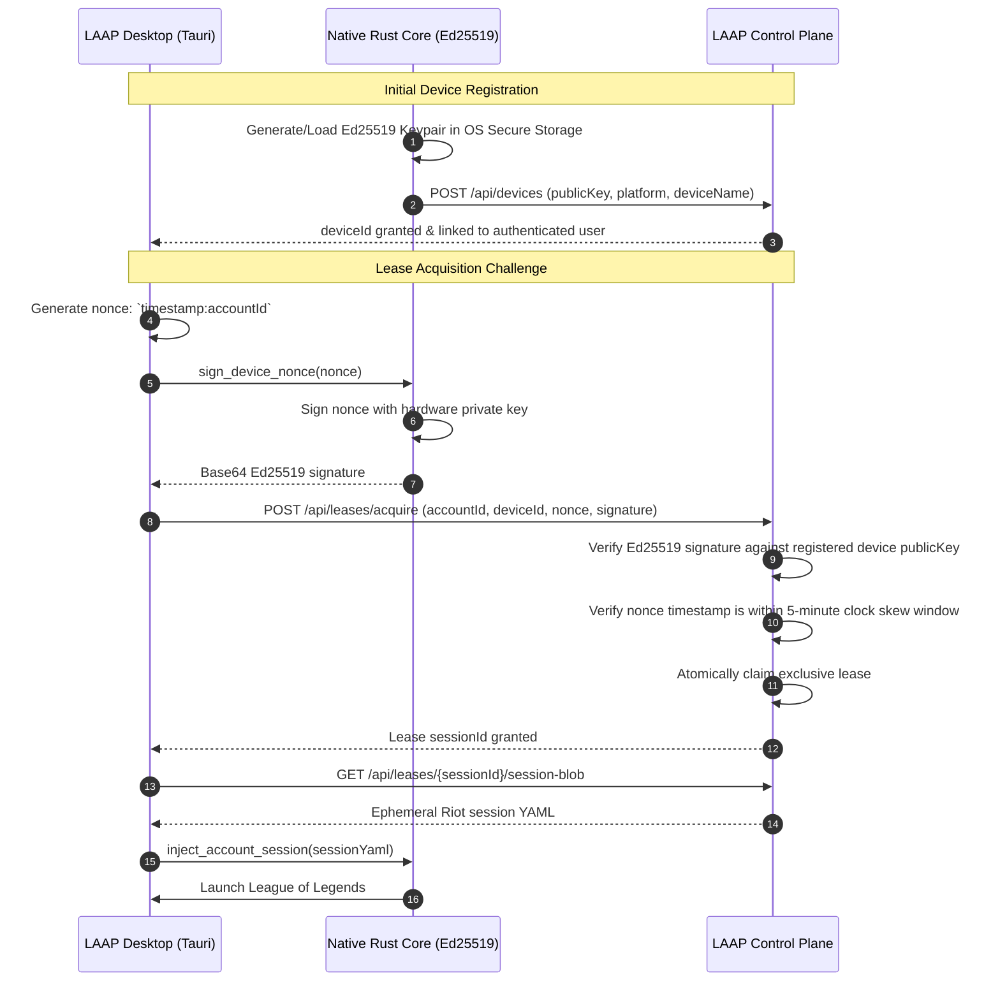

# LAAP Security & Cryptographic Model

This document outlines the security architecture, cryptographic verification protocols, and Riot Client interaction model implemented across **LAAP**.

---

## 1. Core Threat Model

| Threat | Impact | Mitigation Strategy |
| ------ | ------ | ------------------- |
| **Credential Theft** | Loss of account access or password leaks | **Zero Plaintext Passwords**: Passwords are never collected, hashed, or stored. Only short-lived Riot session tokens are handled. |
| **Session Hijacking** | Unauthorized user steals an account lease | **Ed25519 Hardware Nonces**: All lease claims must be cryptographically signed by the requesting machine's private key. |
| **Concurrent Play** | Two users sign into the same account simultaneously | **Exclusive DB Locks**: Atomic transactions enforce single-active lease constraints at the database level. |
| **Data Leakage on Shared PCs** | Subsequent PC users inherit previous sessions | **Automatic Teardown**: Releasing an account scrubs injected YAML files and restores original settings. |
| **Anti-Cheat Interference** | Anti-cheat bans from tampering with game memory | **No Memory Injection**: LAAP strictly manipulates standard configuration files before client launch; Vanguard memory space is never touched. |

---

## 2. Passwordless Session Architecture

Traditional account switchers prompt users for their Riot username and password, storing them in plain text or reversible encryption. **LAAP strictly forbids this pattern.**

---

## 3. Cryptographic Hardware Challenge Protocol

When operating in **Team Vault (Cloud Mode)**, an operator cannot claim an account lease using just a user token. The hardware machine itself must be authenticated.

---

## 4. Vanguard & Anti-Cheat Compatibility

- LAAP acts strictly as an **external orchestrator**.
- LAAP writes configuration files **before** the Riot Client or League processes start.
- LAAP does **not** hook Direct3D, does not use DLL injection, does not modify game executable memory, and does not inspect game packets.
- This ensures 100% compliance with Riot's Terms of Service and Vanguard integrity requirements.

👉 **For comprehensive technical source code proofs, Windows/macOS API audits, and independent verification steps, see [Anti-Ban Verification](ANTI_BAN_VERIFICATION.md).**

